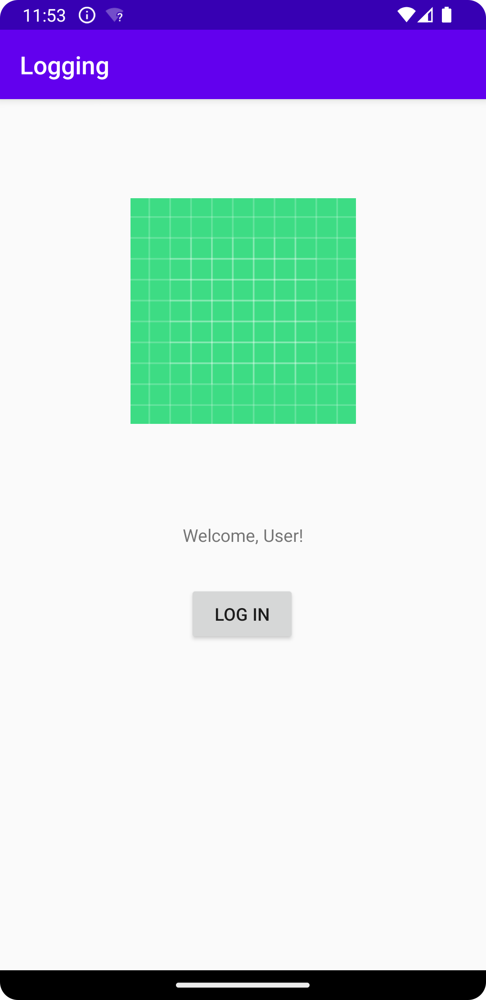

# Rapport

**Skriv din rapport här!**

Använt en constraint-layout och lagt till en TextView, ImageView, och en Button.
Flyttat på widgetarna med hjälp av constraints, och en marginVertical på TextView.
För att få rätt förhållande mellan widgetarna har constraint för top, bottom,
right, och left använts. För knappen har även bias lagts till för
att knappen ska hamna närmare TextView. Om endast constraint används kommer 
knappen hamna vertikalt centrerat mellan TextView och botten på appen.

Kodsnutt för knappen: 
```
<Button
        android:id="@+id/button"
        android:layout_width="wrap_content"
        android:layout_height="wrap_content"
        android:text="@string/log_in"
        app:layout_constraintBottom_toBottomOf="parent"
        app:layout_constraintHorizontal_bias="0.498"
        app:layout_constraintLeft_toLeftOf="parent"
        app:layout_constraintRight_toRightOf="parent"
        app:layout_constraintTop_toBottomOf="@+id/TextView"
        app:layout_constraintVertical_bias="0.103" />
```

Bild på appen:



Läs gärna:

- Boulos, M.N.K., Warren, J., Gong, J. & Yue, P. (2010) Web GIS in practice VIII: HTML5 and the canvas element for interactive online mapping. International journal of health geographics 9, 14. Shin, Y. &
- Wunsche, B.C. (2013) A smartphone-based golf simulation exercise game for supporting arthritis patients. 2013 28th International Conference of Image and Vision Computing New Zealand (IVCNZ), IEEE, pp. 459–464.
- Wohlin, C., Runeson, P., Höst, M., Ohlsson, M.C., Regnell, B., Wesslén, A. (2012) Experimentation in Software Engineering, Berlin, Heidelberg: Springer Berlin Heidelberg.
